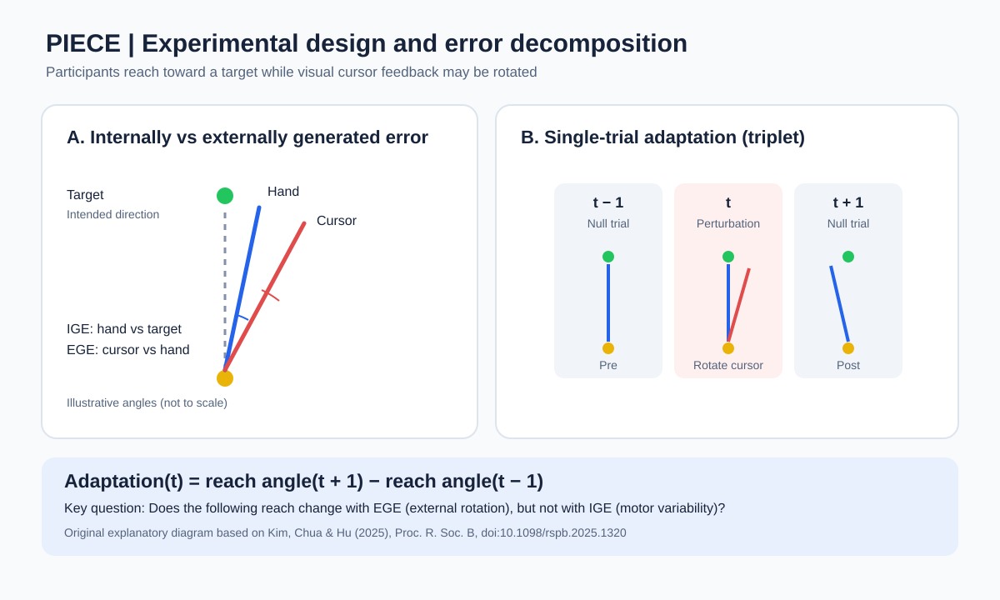

# PIECE

### Parsing of Internal and External Causes of Error

Reproducing the Bayesian computational model of sensorimotor adaptation proposed by Kim et al. (2025).

## Overview

This project aims to reproduce the **Parsing of Internal and External Causes of Error (PIECE)** model introduced by Kim et al. (2025) in *Causal inference, prediction and state estimation in sensorimotor learning*.

In sensorimotor learning, the nervous system must distinguish between errors arising from intrinsic motor variability and those caused by external perturbations. While internally generated errors (IGE) should generally be ignored to avoid maladaptive corrections, externally generated errors (EGE) require adaptation to maintain accurate motor performance.

The PIECE model provides a Bayesian computational framework for explaining this distinction. By integrating visual, proprioceptive, and motor prediction cues, the model infers the probability that an observed movement error was caused by an external perturbation. This posterior probability is then combined with Bayesian state estimation of the perturbation magnitude to determine the adaptive motor response.

The primary objective of this project is to **implement the PIECE model from scratch in Python**, using the original experimental dataset released by the authors. Rather than relying on the authors' existing implementation, this project reconstructs the mathematical framework and parameter estimation procedures directly from the published equations.

The reproduction focuses on:

- Implementing Bayesian causal inference and perturbation state estimation.
- Estimating participant-specific model parameters using maximum likelihood estimation (MLE).
- Reproducing key behavioral results and model predictions reported in the original study.
- Evaluating model performance using Bayesian Information Criterion (BIC) and posterior predictive checks.
- Comparing PIECE with alternative sensorimotor adaptation models (PReMo, PEA, and REM).

Ultimately, this project seeks to validate the computational mechanisms underlying PIECE and establish a reproducible foundation for future extensions of Bayesian models of sensorimotor learning.
## Experimental Design

This project reproduces the PIECE model using the original experimental dataset from Kim et al. (2025).

### Experimental Setup

The experiment investigated how the sensorimotor system distinguishes between internally generated errors (IGE) and externally generated errors (EGE).

Sixteen participants performed rapid reaching movements toward a visual target while controlling a cursor on a screen. The researchers introduced small visuomotor rotations of 0°, ±2°, and ±4° to examine how participants adapted their subsequent movements.

### Experimental Procedure

1. **Baseline:** Participants completed 70 unperturbed reaching trials.
2. **Perturbation:** Visual cursor feedback was rotated relative to the actual hand movement.
3. **Adaptation:** Changes in reaching direction were measured using trials immediately before and after each perturbation.
4. **Analysis:** Adaptive responses to internally and externally generated errors were

